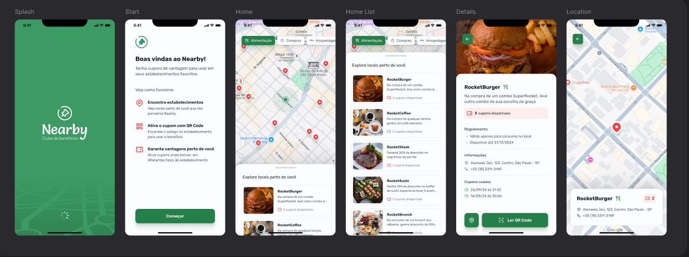

# Nearby - Food Delivery 📍

O Nearby é um aplicativo de clube de benefícios que permite aos usuários encontrar estabelecimentos próximos, visualizá-los em um mapa interativo e resgatar cupons de desconto através da leitura de QR Codes.



## ✨ Funcionalidades

- 🗺️ **Mapa Interativo**: Visualize estabelecimentos parceiros em um mapa do Google Maps
- 📍 **Localização**: Encontre estabelecimentos próximos à sua localização
- 🏷️ **Categorias**: Filtre estabelecimentos por categorias (Alimentação, Cinema, Compras, etc.)
- 🎟️ **Cupons**: Visualize cupons disponíveis em cada estabelecimento
- 📱 **QR Code Scanner**: Escaneie QR Codes para resgatar cupons de desconto
- 📋 **Detalhes**: Veja informações detalhadas sobre cada estabelecimento (endereço, telefone, regras)

## 🛠️ Tecnologias Utilizadas

- **Kotlin** - Linguagem de programação
- **Jetpack Compose** - UI moderna e declarativa
- **Google Maps Compose** - Integração com mapas
- **Ktor** - Cliente HTTP para comunicação com API
- **Kotlin Serialization** - Serialização de dados
- **Navigation Compose** - Navegação entre telas
- **Coil** - Carregamento de imagens
- **ZXing** - Leitura de QR Codes
- **Material Design 3** - Design system

## 🚀 Como Rodar o Projeto

### 📋 Pré-requisitos

- **Node.js** (versão 18 ou superior) - Para o backend
- **Android Studio** (versão mais recente) - Para o mobile
- **JDK 11 ou superior**
- **Android SDK** (API 24 ou superior)
- **Dispositivo Android** ou **Emulador** configurado

---

## 🖥️ Backend (API)

O backend é uma API REST desenvolvida com Node.js, Express e Prisma.

### Executar o Backend

1. **Navegue até a pasta do backend**
   ```bash
   cd backend
   ```

2. **Instale as dependências**
   ```bash
   npm install
   ```

3. **Configure o banco de dados**
   ```bash
   npx prisma migrate dev
   npx prisma db seed
   ```

4. **Inicie o servidor**
   ```bash
   npm start
   ```

O servidor estará rodando em `http://localhost:3333`

---

## 📱 Mobile (Android App) - **FOCO PRINCIPAL**

Aplicativo Android desenvolvido com Kotlin e Jetpack Compose.

### Passo a Passo

1. **Clone o repositório**
   ```bash
   git clone https://github.com/thomascostta/nearby-food.git
   cd nearby-food
   ```

2. **Abra o projeto Mobile no Android Studio**
   - Abra o Android Studio
   - Selecione "Open an Existing Project"
   - Navegue até a pasta `mobile/` e selecione-a
   - Aguarde a sincronização do Gradle

3. **Configure a API do Google Maps** ⚠️ **IMPORTANTE**
   
   O aplicativo requer uma chave da API do Google Maps:
   
   **a) Obter a chave:**
   - Acesse o [Google Cloud Console](https://console.cloud.google.com/)
   - Crie um novo projeto ou selecione um existente
   - Ative a **Maps SDK for Android**
   - Vá em **Credenciais** → **Criar Credenciais** → **Chave de API**
   - Copie a chave gerada
   
   **b) Configurar no projeto:**
   - Abra `mobile/app/src/main/AndroidManifest.xml`
   - Localize `com.google.android.geo.API_KEY`
   - Substitua `YOUR_GOOGLE_MAPS_API_KEY_HERE` pela sua chave:
     ```xml
     <meta-data
         android:name="com.google.android.geo.API_KEY"
         android:value="SUA_CHAVE_AQUI" />
     ```
   
4. **Configure a conexão com o Backend**
   
   **Para Emulador Android:**
   - Abra `mobile/app/src/main/java/com/thomascosta/nearby/core/network/NearbyRemoteDataSource.kt`
   - Certifique-se que `BASE_URL = LOCAL_HOST_EMULATOR_BASE_URL`
   - O emulador usa `10.0.2.2` para acessar o localhost
   
   **Para Dispositivo Físico:**
   - Descubra o IP da sua máquina:
     - Linux/Mac: `ifconfig` ou `ip addr`
     - Windows: `ipconfig`
   - Abra `NearbyRemoteDataSource.kt` e altere:
     ```kotlin
     private const val LOCAL_HOST_PHYSICAL_BASE_URL = "http://SEU_IP:3333"
     const val BASE_URL = LOCAL_HOST_PHYSICAL_BASE_URL
     ```
   - Certifique-se que o dispositivo está na mesma rede Wi-Fi

5. **Execute o aplicativo**
   - Conecte um dispositivo Android via USB (com depuração USB habilitada) **ou**
   - Inicie um emulador Android
   - Clique no botão "Run" (▶️) no Android Studio ou pressione `Shift + F10`

6. **Teste o aplicativo**
   - Conceda as permissões de localização e câmera quando solicitado
   - Explore os estabelecimentos no mapa
   - Teste o scanner de QR Code para resgatar cupons

## 📱 Requisitos Mínimos

- Android 7.0 (API 24) ou superior
- Conexão com internet
- Permissão de localização (para visualizar estabelecimentos próximos)
- Câmera (para escanear QR Codes)

## 🔒 Segurança

**ATENÇÃO**: Este projeto contém configurações que devem ser personalizadas:

1. **API Key do Google Maps**: 
   - Nunca faça commit da sua chave em repositórios públicos
   - Use restrições de API no Google Cloud Console
   - Limite o uso apenas para o package `com.thomascosta.nearby`

2. **Configuração do Backend**:
   - O arquivo `.env` do backend não está versionado
   - Ajuste o `BASE_URL` no mobile conforme seu ambiente (emulador/dispositivo físico)

3. **Boas práticas**:
   - Mantenha arquivos sensíveis no `.gitignore`
   - Use variáveis de ambiente para dados sensíveis em produção
   - Configure restrições adequadas nas APIs utilizadas

## 📄 Estrutura do Projeto

```
nearby-food/
├── backend/                   # API REST (Node.js + Express)
│   ├── prisma/               # Schema e migrations do banco
│   ├── src/
│   │   ├── controllers/      # Controllers da API
│   │   ├── routes/           # Rotas da API
│   │   └── server.ts         # Servidor principal
│   └── package.json
│
└── mobile/                   # Aplicativo Android (Kotlin)
    └── app/
        └── src/main/java/com/thomascosta/nearby/
            ├── core/network/         # Cliente HTTP (Ktor)
            ├── data/model/           # Modelos de dados
            ├── ui/
            │   ├── component/        # Componentes reutilizáveis
            │   ├── screen/           # Telas do app
            │   │   ├── home/         # Tela principal com mapa
            │   │   ├── market_details/  # Detalhes do estabelecimento
            │   │   ├── qrcode_scanner/  # Scanner de QR Code
            │   │   └── welcome/      # Tela de boas-vindas
            │   ├── route/            # Navegação
            │   └── theme/            # Tema e estilos
            └── MainActivity.kt       # Activity principal
```

## 📝 Licença

Este projeto foi desenvolvido para fins educacionais.

---

Desenvolvido com ❤️ durante o **NLW Pocket Mobile Android** da **Rocketseat**
